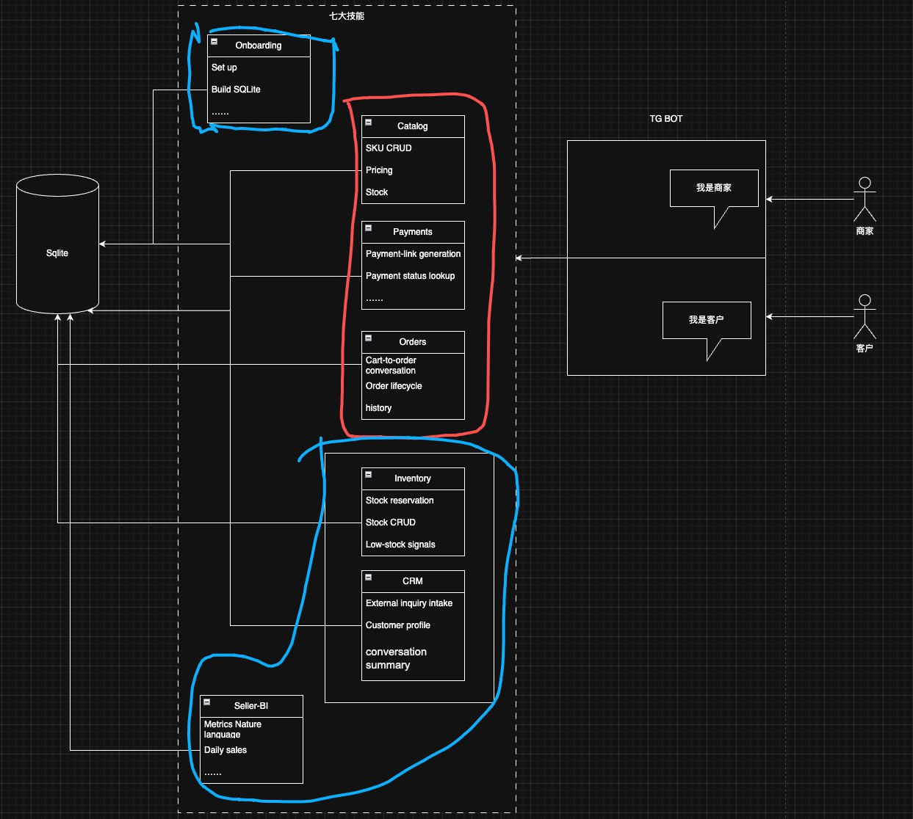

# DealAgent

DealAgent is a chat-first merchant operations skill built for OpenClaw / PurrfectClaw. It turns customer conversations into executable business actions across catalog, inventory, CRM, orders, payments, and seller analytics.

## Featured Links

### Uploaded Skill

- Skill Store: [DealAgent on Pieverse Skill Store](https://www.pieverse.io/skill-store?skill=59620)

### Videos

- YouTube: [Watch the promo / showcase video](https://youtu.be/wafhzWRuk_s)
- Bilibili: [Watch the product walkthrough demo](https://www.bilibili.com/video/BV1b9XvBmEEu/?share_source=copy_web&vd_source=c2399b62dab4ff0a9720947d3e3f66e1)

### More Resources

- Additional links and references: coming soon

---

## What DealAgent Does

DealAgent is designed for small merchants who already run their business through chat. Instead of splitting customer service, stock management, ordering, and payments across multiple tools, DealAgent treats the conversation itself as the operating surface.

The current repository focuses on a modular skill-based workflow that can:

- onboard a merchant workspace
- manage catalog items and sellable status
- track inventory, reservations, and low-stock alerts
- capture customer inquiries and conversation context
- create and confirm payment links
- manage the order lifecycle and refund flow
- expose seller BI metrics in natural language

## Product Direction

The first target is a lightweight merchant operations workflow running on top of OpenClaw:

- for merchants: reduce the switching cost between customer replies, inventory updates, order follow-up, and after-sales handling
- for customers: complete inquiry, purchase, payment, and order lookup inside the same conversation flow
- for the system: convert chat activity into structured, auditable business actions instead of leaving it as untracked messages

In that model:

- **PurrfectClaw** is the product entry point
- **OpenClaw** is the skill host and orchestration layer
- **DealAgent** is the business-facing skill package for commerce operations

## Demo Flow

The current demo story is a full merchant-to-customer transaction loop:

1. The merchant completes onboarding.
2. The merchant creates SKUs and reviews sellable inventory.
3. A customer asks about a product inside the same chat surface.
4. The system creates an order draft and generates a payment link.
5. Payment is confirmed through the mock payment path.
6. The order status and inventory state are updated.
7. The merchant can review metrics and process follow-up actions such as refunds.

This flow is meant to show that DealAgent is not just a reply bot. It is an operational layer that connects inquiry, transaction, fulfillment, and reporting.

## Skill Modules

DealAgent v1 currently includes the following business modules:

- **Onboarding**: workspace setup, owner pairing, and initial configuration
- **Catalog**: SKU creation, pricing, and availability management
- **Inventory**: stock adjustment, reservation, release, and low-stock monitoring
- **CRM**: customer inquiry intake, history, and response context
- **Payments**: payment link creation, payment confirmation, and refund handling
- **Orders**: draft creation, order lifecycle management, and status transitions
- **Seller BI**: natural-language business metrics for the merchant side

## Architecture

DealAgent follows a modular skill/runtime structure:

- **Skill layer**: business modules are organized under `skills/`
- **Script/runtime layer**: TypeScript runtime and CLI entrypoints live under `scripts/`
- **Data layer**: SQLite is used as the current source of truth for merchant data
- **Test layer**: Vitest integration coverage verifies the end-to-end business flow

The current design is intentionally lightweight. It keeps the system easy to demo, easy to evolve, and easy to replace with real merchant integrations later.

## Repository Structure

```text
DealAgent/
├── Agent.md
├── SKILL.md
├── TODO.md
├── Archive/
│   └── python/
├── docs/
│   └── v1/
│       ├── code-review/
│       ├── database/
│       ├── demo/
│       ├── execution-plan/
│       ├── product-foundation/
│       └── reference/
├── release/
├── scripts/
│   ├── db/
│   ├── dev/
│   ├── lib/
│   ├── run_low_stock_scan.ts
│   ├── run_skill.ts
│   ├── sync_crm_from_openclaw.ts
│   └── test_skill.ts
├── skills/
│   ├── catalog/
│   ├── crm/
│   ├── inventory/
│   ├── onboarding/
│   ├── orders/
│   ├── payments/
│   └── seller-bi/
├── tests/
│   ├── fixtures/
│   ├── integration/
│   └── unit/
└── PurrSuiteFramework-v1.jpg
```

## Framework Overview



At a high level:

- the platform entry can connect to different channels over time
- merchant and customer interactions share a conversation-first interface
- business capabilities are split into reusable skill modules
- SQLite is the current system of record for product, inventory, order, payment, and customer state

## Documentation

- Product spec: [docs/v1/product-foundation/v1-product-spec.md](docs/v1/product-foundation/v1-product-spec.md)
- Demo spec: [docs/v1/product-foundation/v1-demo-spec.md](docs/v1/product-foundation/v1-demo-spec.md)
- SQLite design: [docs/v1/database/sqlite-design.md](docs/v1/database/sqlite-design.md)
- Development plan: [docs/v1/execution-plan/v1-development-plan.md](docs/v1/execution-plan/v1-development-plan.md)
- Skill contracts: [docs/v1/execution-plan/v1-skill-contracts.md](docs/v1/execution-plan/v1-skill-contracts.md)

## Quick Start

### Prerequisites

- Node.js `24.14.0`
- npm

### Install

```bash
npm ci
```

### Type Check

```bash
npm run typecheck
```

### Build

```bash
npm run build
```

### Test

```bash
npm test
```

## What To Add Next

When the remaining links are ready, the README can be extended with:

- a landing page or official website link
- a live demo or bot entry link
- product documentation links for external readers
- screenshots or GIFs for the main workflow
- press kit / pitch deck / judge-facing materials
